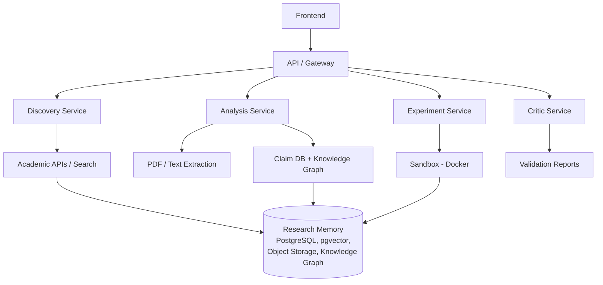
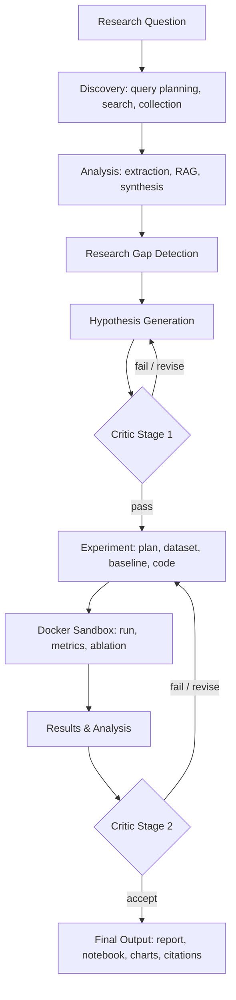

# Architecture

> Status: Foundation. Frontend scaffolded; backend services in progress.

## Overview

The frontend sends requests to an API gateway (FastAPI). The gateway orchestrates four services: Discovery, Analysis, Experiment and Critic. All services read and write a shared Research Memory.

## System architecture

## Research pipeline

## Components

| Component | Responsibility | Location in repo | Owner |
|---|---|---|---|
| Frontend | Research workflow interface, results views, auth pages | `frontend/` | TBD |
| API / Gateway | Service endpoints and request orchestration | `backend/` | TBD |
| Discovery, Analysis, Experiment, Critic | Agent services | `backend/` | TBD |

## Key decisions

| Decision | Alternatives considered | Reason | Date |
|---|---|---|---|
| Separate `frontend/` and `backend/` folders | Single `src/` | Different runtimes and CI jobs | 2026-10-10 |

## Open questions

- Auth flow between Supabase and FastAPI
- Backend endpoint contract
